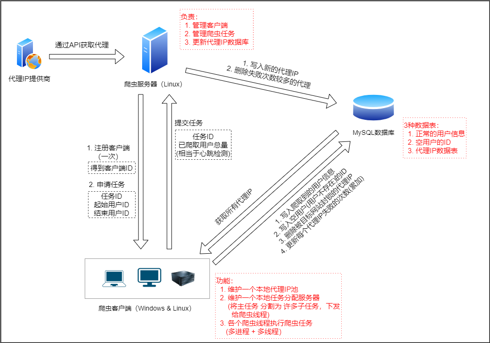
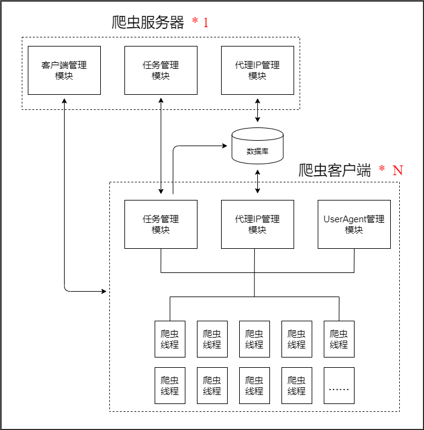

## bilibili用户信息爬虫

## 0. 成果

bilibili御坂网络计划： https://misaka.sisters.top

>  备用网址：https://misakasisters.bilibiliq.com

> 只保留与此相关的数据，其余数据已删除

## 1. 环境

开发环境

|          | 服务器          | 客户端          | 管理程序      |
| -------- | --------------- | --------------- | ------------- |
| 语言     | C++11           | C++11           | C++11         |
| 开发环境 | Linux/vim/xmake | VS2017          | VS2017+Qt5.12 |
| 运行环境 | Linux           | Windows / Linux | Windows       |

其他环境

| 配置项 | 值           |
| ------ | ------------ |
| 数据库 | MySQL-8.0.20 |

>客户端是在Windows下开发的，但是代码可以直接放到到Linux上编译运行。
>
>管理程序是在Windows下用VS2017开发的，也可以移植到Linux上使用Qt Creator开发（没有测试，不过代码基本上没有用到平台相关的函数，有的话也通过`_WIN32`宏进行了区分）。
>
>服务器和客户端均可在内网或公网上运行，只要能够通过IP或域名访问到即可。

## 2. 库

+ [open-source-parsers/Jsoncpp](https://github.com/open-source-parsers/jsoncpp): 解析Json。添加了几个实用函数 (src/json/json.h)
+ [gabime/spdlog](https://github.com/gabime/spdlog): 日志库。进行了简单封装 (src/log/logger.h)
+ [libmysql](https://dev.mysql.com/downloads/c-api/): MySQL官方的C API。进行了简单封装 (src/database/mysql_instance.h)
+ [hongliuliao/ehttp](https://github.com/hongliuliao/ehttp): Http server。This library make http (with json) microservice easy! 
+ [Leopard-C/iclient](https://github.com/Leopard-C/iclient): 封装的libcurl，进行http请求。（个人仓库）

## 3. 爬虫框架

### 3.1 框架图






### 3.2 说明

#### 3.2.1 代理IP

使用的代理IP提供商，IP有效时间1-5分钟，不固定，所以通过记录每个代理IP请求失败的次数，达到阈值(比如30)就认为该IP失效，清除该IP。

#### 3.2.2 爬虫服务器 （Linux）

+ 管理客户端，包括客户端的加入、退出、心跳检测。

  + 客户端加入：返回一个clientID，自增，不会重复。
  + 客户端退出（主动）：删除该客户端，回收其未完成的任务。
  + 客户端心跳检测：客户端每次申请任务、提交任务都视为一次心跳检测。
  + 客户端退出（被动）：如果检测到客户端长时间没有心跳，就将该客户端踢出，并回收其未完成的任务（假如该客户端仍然存活，那么下一次申请或者提交任务时，就会被拒绝，然后客户端就会自动退出）
  + <font color="red">复用：客户端每次申请(提交)任务，都相当于完成了三件事：申请(提交)任务、报告该客户端已经爬取的用户信息数量、心跳检测。将三种请求合并为一次，旨在减轻服务器端的压力，而且能减轻代码的复杂度。</font>

+ 管理爬虫任务，包括申请任务、提交任务。任务结构体定义如下：

  ```C++
  struct BiliTask {
      int clientId; /* 申请该任务的客户端ID */
  	unsigned int midStart;  /* 起始用户ID */
  	unsigned int midEnd;    /* 终止用户ID（不含） */
      time_t ttl;    /* 过期时间，如果在这之前没有提交任务，就回收该任务，重新分配 */
  };
  ```

+ 更新代理IP数据库。根据购买的代理IP的使用规则，间隔指定时间，从服务商那里获取新的代理IP，添加到数据库，同时，清除数据库中失效的代理IP（失败次数达到阈值）。

#### 3.2.3 爬虫客户端 （Windows & Linux）

这里`客户端`，指的是一个`进程`。每个`进程`中又运行着`多个线程`，真正的爬虫过程是在`线程`里执行的。

每个客户端：

+ 维护一个代理IP池，或者称之为代理IP管理器。（src/manager/ProxyManager），关键成员变量是`proxies`

  ```C++
  //      <代理IP信息，失败次数>
  std::map<ProxyData, int> proxies;
  ```

  + 爬虫线程每次爬取用户信息时，就从本地代理IP池中随机取一个代理IP。
  + 如果使用某个代理IP爬虫失败
    + 原因是该代理IP的质量问题 ==> 记录该代理IP失败次数加一
    + 原因是该代理IP被目标网站封锁 ==> 删除该IP（本地和数据库中都删除）
  + 间隔指定时间：
    + 将本地代理IP池中，每个IP失败的次数更新到数据库中；
    + 清空本地代理IP池；
    + 取出数据库中所有代理IP（失败次数小于阈值），放入本地代理IP池中。

+ 维护一个任务分配管理器（为了和服务器端区分，这里称之为`LocalTaskManager`）。
  
  + `LocalTaskManager`向爬虫服务器的任务管理器（这里称之为`ServerTaskManager`）申请一个`MainTask`，然后细分为许多个`SubTask`，下发给每个爬虫线程。如果`MainTask`下发完毕（可能还没有完成），就继续申请`MainTask`。
  
  + 爬虫线程向`LocalTaskManager`提交`SubTask`：
  
    + 成功的部分 ==> 缓存，缓存满（或间隔了一定量的用户）再一次性写入数据库。需要区分用户信息为空和非空两类。
    + 失败的部分 ==> 记录下来，之后爬虫线程向`LocalTaskManager`申请任务时，优先分配这些用户ID。
  
  + `MainTask`全部执行完成，提交到`ServerTaskManager`。（凡是提交的任务，任务中的所有用户信息都爬取成功并写入了数据库！！！）
  
    ```C++
    /* 主任务 */
    struct MainTask {
        MainTask() = default;
        MainTask(int id, unsigned int start, unsigned int end) :
            id(id), midStart(start), midEnd(end) {}
        bool isCompleted() const { return completed >= midEnd - midStart; }
        int id = -1;
        unsigned int midStart = 0;
        unsigned int midEnd = 0;
        unsigned int completed = 0;
    };
    /* 子任务 */
    struct SubTask {
        SubTask(int mainTaskId, const std::vector<unsigned int>& mids) :
            mainTaskId(mainTaskId), mids(mids) {}
        int mainTaskId;  /* 该子任务所属的主任务的id */
        std::vector<unsigned int> mids;
    };
    ```

#### 3.2.4 MySQL数据库

三种数据表

+ 非空的用户信息，每200万个用户一个数据表

  

+ 空的用户信息，每200万个用户一个数据表，只记录用户ID

  

+ 代理IP数据表

  

## 4. 爬虫情况

### 4.1 爬虫环境

以下每个进程中都开了50个线程。

+ 一台Linux小主机：主要作为爬虫服务器，同时也运行着爬虫客户端（3~6个进程，非主力）
  + CPU：5代i3
  + MEM：8G
+ 一台Linux笔记本：爬虫客户端（5+个进程，半个主力）
  + CPU：7代i5
  + MEM：8G
+ 一台Windows台式机：爬虫客户端（10+个进程，主力）
  + CPU：9代i5
  + MEM：16G
+ 一台Windows台式机：MySQL数据库，爬虫客户端（10+个进程，绝对主力）
  + CPU：2代R5
  + MEM：16G

<font color="red">【注意】 客户端必须能够通过IP访问到服务器和Mysql数据库，服务器也必须能够访问到Mysql数据库。</font>

### 4.2 启动爬虫客户端

客户端只需要配置一个配置文件 `config/spider.json`，填入爬虫服务器的地址、启动的爬虫线程数 和`Token`。然后运行即可。

```json
{
  "server_addr": "10.133.xxx.xxx:10033",
  "threads": 50,
  "token": "bhKyhZpFAp3T"
}
```

至于其他配置（比如MySQL数据库信息，爬虫超时设置等），都是<font color="red">直接从服务器端获取，所以只需要知道爬虫服务器的地址就行了。</font>

### 4.3 爬虫管理界面（使用Qt）

如4.4所示（最终版）

### 4.4 爬虫速度

最快的时候可以850 ~ 1100 个用户/秒，每天累计 `8千万+`，理论上可以更快，但是需要人留意观察，白天一般满速爬取，晚上睡觉前一般关掉几个客户端，降低一下爬虫速度，防止出现”击穿的情况“（此问题已解决）。

爬虫速度由两方面决定

+ 计算机的性能
+ 代理IP的质量和数量

这个速度基本上达到了代理IP的瓶颈（利用率估计90%+），计算机的性能倒是没有达到瓶颈（CPU利用率低于30%，爬虫的同时，不影响正常使用）

> 我认为提高代理IP使用率的方法，是将爬虫的超时时间设置大一点，允许的错误次数设置多一点，然后就是疯狂开进程(+线程)，比如开几十个上百个进程，上千个线程。这样可以榨干代理IP。（只是个人见解）


## 5. 感受

人生苦短，我用C++。

C++可以写爬虫。

C++写爬虫可能不是一个好的选择。

C++写的爬虫可以很强大。

## END

Github: [Leopard-C/BiliUserSpider](https://github.com/Leopard-C/BiliUserSpider)

Email: <leopard.c@outlook.com>

